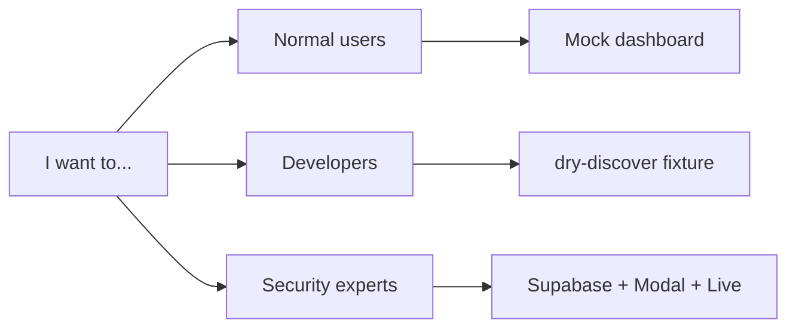

# Quickstart

> Start here for the fastest setup. Then follow `README.md` for all related docs and contribution paths.

Pick one path:

- [Normal users](#normal-users) (no cloud)
- [Developers](#developers) (no cloud by default)
- [Security experts](#security-experts) (live/credentialed)



---

## Normal users

See the dashboard in about two minutes. No Supabase or Modal required if you use
**Mock (demo data)**.

**Prerequisites:** Git, **Node.js 22** (`.nvmrc`). Tool matrix:
[docs/user-guide/prerequisites.md](docs/user-guide/prerequisites.md).

```bash
git clone https://github.com/neomatrix369/tripwire.git
cd tripwire
node scripts/serve-dashboard.mjs
# open http://127.0.0.1:8765/Tripwire.dc.html
# Guard tab → Data source → Mock (demo data)
# (Live is UI default)
```

**Success:** Dashboard loads and status chip shows **Demo data**.

---

## Developers

Install CLI dependencies and run fixture discovery without external accounts.

**Prerequisites:** Git, **Node.js 22**, npm —
[docs/user-guide/prerequisites.md](docs/user-guide/prerequisites.md).

```bash
cd cli && npm install && npm link
cd ..
tripwire scan --dry-discover ./fixtures/skills/safe-csv-cleaner
```

`--dry-discover` prints discovered targets and exits **without** spawning Modal.

**Success:** CLI prints discovered skill/MCP targets and exits 0.

See fixtures and expected fixture behavior: [fixtures/README.md](fixtures/README.md).

---

## Security experts

Run schema bootstrap, secrets sync/deploy, full scan, and Live dashboard.

**Prerequisites:** Node.js 22, Python 3.12 + `modal`, Supabase + Modal accounts.
Complete setup guides before copying `.env`:

1. [docs/user-guide/prerequisites.md](docs/user-guide/prerequisites.md)
2. [docs/user-guide/supabase-setup.md](docs/user-guide/supabase-setup.md)
3. [docs/user-guide/modal-setup.md](docs/user-guide/modal-setup.md)
4. [docs/user-guide/env-vars.md](docs/user-guide/env-vars.md)

```bash
cp .env.example .env
# Fill required values using env-vars.md first.

cd cli && npm install && npm link && cd ..
tripwire setup
# if schema changed later:
tripwire setup --force

pip install modal
./scripts/setup-modal.sh

tripwire scan ./fixtures/skills/safe-csv-cleaner
tripwire scan ./fixtures/mcp/mcp_manifest.json

node scripts/serve-dashboard.mjs
# Guard tab → Live (Supabase)
```

**Success:** Dashboard shows scan runs in Live mode (or empty if no matching findings
and services are healthy).

Useful references:
[env-vars.md](docs/user-guide/env-vars.md) · [.env.example](.env.example) ·
[OPTIONAL_SCANNER_KEYS.md](fixtures/OPTIONAL_SCANNER_KEYS.md)

---

## Regular checks (run after any significant change)

```bash
cd cli && npm test
pytest sandbox/test_acquire_target.py
cd prototypes/dc-dashboard && npm test
./scripts/quality-gates.sh --quick
```

Use full checks only when preparing commit/PR:

```bash
./scripts/quality-gates.sh
```

---

## Next steps

- Docs map: [docs/README.md](docs/README.md)
- New starter path: [docs/user-guide/onboarding-cheatsheet.md](docs/user-guide/onboarding-cheatsheet.md)
- Architecture: [docs/ARCHITECTURE.md](docs/ARCHITECTURE.md)
- Capability status: [docs/STATUS.md](docs/STATUS.md)
- Contributing: [CONTRIBUTING.md](CONTRIBUTING.md)

---

<!-- Primary stack -->
[](https://cursor.com)
[](https://modal.com)
[](https://supabase.com)
[](https://github.com/neomatrix369/tripwire)

<!-- Scanner & partner -->
[](https://developer.cisco.com)
[](https://snyk.io)
[](https://tessl.io)
