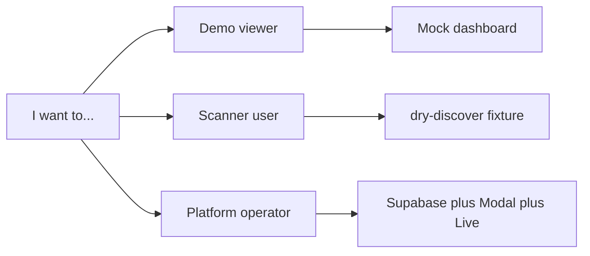

# Quickstart

> Once setup is done, head to the [README](README.md) for docs paths and contributing.

Pick **one** path. Details for Live vs Mock dashboard:
[prototypes/README.md](prototypes/README.md). Capability evidence:
[docs/STATUS.md](docs/STATUS.md).



---

## Demo viewer

See the dashboard in about two minutes. No Supabase or Modal required if you use
**Mock (demo data)**.

**Prerequisites:** Git, Node.js

```bash
git clone https://github.com/neomatrix369/tripwire.git
cd tripwire
node scripts/serve-dashboard.mjs
# open http://127.0.0.1:8765/Tripwire.dc.html
# Guard tab → data source → Mock (demo data)
```

**Success:** Dashboard loads; status chip shows **Demo data** (or Live if you
already have keys — see prototypes README).

More: [prototypes/README.md](prototypes/README.md)

---

## Scanner user

Install the CLI and discover (or scan) a fixture without reading the whole repo.

**Prerequisites:** Git, Node.js, npm

```bash
cd cli && npm install && npm link
cd ..
tripwire scan --dry-discover ./fixtures/skills/safe-csv-cleaner
```

`--dry-discover` prints discovered targets and exits **without** spawning Modal.

A full `tripwire scan` (no `--dry-discover`) needs the [Platform operator](#platform-operator)
path (Supabase + deployed sandbox).

**Success:** CLI prints discovered skill/MCP targets and exits 0.

Fixtures: [fixtures/README.md](fixtures/README.md)

---

## Platform operator

Run the full stack: DB bootstrap, Modal sandbox, real scan, Live dashboard.

**Prerequisites:** Node.js, Python + `modal`, Supabase project, Modal account

```bash
cp .env.example .env
# Set SUPABASE_URL, SUPABASE_SERVICE_ROLE_KEY, SUPABASE_DB_URL (postgresql://)
# Prefer Session pooler URI if db.<ref>.supabase.co does not resolve
# Optional Live browser: SUPABASE_ANON_KEY — or use serve-dashboard.mjs proxy

cd cli && npm install && npm link && cd ..
tripwire setup                 # apply DDL; or ./scripts/setup-supabase.sh
# Re-run: tripwire setup --force after schema pulls

pip install modal
./scripts/setup-modal.sh       # auth + secrets sync + deploy
# Flags: --secrets-only | --deploy-only | --non-interactive | --env-file PATH
# Keys: fixtures/OPTIONAL_SCANNER_KEYS.md

tripwire scan ./fixtures/skills/safe-csv-cleaner
tripwire scan ./fixtures/mcp/mcp_manifest.json

node scripts/serve-dashboard.mjs
# Guard tab → Live (Supabase)
```

**Success:** Scan creates rows in Supabase; dashboard Live chip shows items (or
empty if no rows yet). Operator evidence notes: [docs/STATUS.md](docs/STATUS.md).

Also: [.env.example](.env.example) ·
[fixtures/OPTIONAL_SCANNER_KEYS.md](fixtures/OPTIONAL_SCANNER_KEYS.md)

---

## Verify (optional)

```bash
cd cli && npm test
pytest sandbox/test_acquire_target.py
cd prototypes/dc-dashboard && npm test
```

Contributor checks: [CONTRIBUTING.md](CONTRIBUTING.md)

---

## Next steps

- Docs map: [docs/README.md](docs/README.md)
- Architecture (diagrams): [docs/ARCHITECTURE.md](docs/ARCHITECTURE.md)
- Capability status: [docs/STATUS.md](docs/STATUS.md)
- Contribute: [CONTRIBUTING.md](CONTRIBUTING.md)

---

<!-- Primary stack -->
[](https://cursor.com)
[](https://modal.com)
[](https://supabase.com)
[](https://github.com/neomatrix369/tripwire)

<!-- Scanner & partner -->
[](https://developer.cisco.com)
[](https://snyk.io)
[](https://tessl.io)
