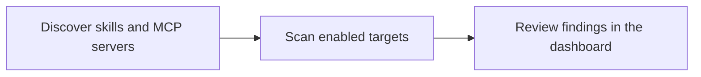

# Tripwire

> Discover and scan AI skills and MCP servers, then review the findings in one dashboard.

## Start safely

With [Node 22](docs/user-guide/prerequisites.md) installed, open the credential-free
Mock dashboard:

```bash
git clone https://github.com/neomatrix369/tripwire.git
cd tripwire
node scripts/serve-dashboard.mjs
```

Open [http://127.0.0.1:8765/Tripwire.dc.html](http://127.0.0.1:8765/Tripwire.dc.html).
It starts with Mock demo data when Supabase is not configured; select Live only after
you have configured it. No account or secret is needed for this first look.

| Instead of… | You can… |
|---|---|
| Starting with provider credentials | Explore a local Mock dashboard first |
| Guessing what to scan | Discover skills and MCP servers with the CLI |
| Losing scan evidence across tools | Review findings in one dashboard |

## What happens next

The workflow is deliberately small: discover the target, scan it with the enabled
adapters, then review the result. Mock lets you explore the final step safely; Live
adds Supabase, Modal, and optional scanner providers when you need real scans.



## Find the right guide

| Your task | Start here |
|---|---|
| Try Tripwire locally | [Validate locally in QUICKSTART](QUICKSTART.md#validate-locally) |
| Set up Live scanning | [Live capabilities in QUICKSTART](QUICKSTART.md#live-capabilities) |
| Understand results and system shape | [Capability status](docs/STATUS.md) · [Architecture](docs/ARCHITECTURE.md) |
| Contribute or maintain the project | [Contributing](CONTRIBUTING.md) · [command catalog](docs/user-guide/setup-commands.md) |

For the full documentation map, see [docs/README.md](docs/README.md). The
[prerequisites](docs/user-guide/prerequisites.md), [environment-variable guide](docs/user-guide/env-vars.md),
and [setup command catalog](docs/user-guide/setup-commands.md) hold the detailed setup
and maintenance instructions.

## Proof and integrations

[](https://github.com/neomatrix369/tripwire/actions/workflows/ci.yml)
[](https://github.com/neomatrix369/tripwire/actions/workflows/nightly.yml)
[](https://cursor.com)
[](https://modal.com)
[](https://supabase.com)
[](https://developer.cisco.com)
[](https://snyk.io)
[](https://tessl.io)
