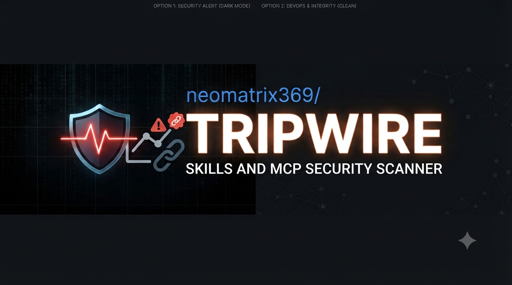
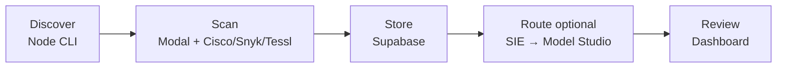

# Tripwire

> Discover and scan AI skills and MCP servers, then review the findings in one dashboard.

<!-- badges:start -->
<!-- Group 1: Tech stack -->


<!-- Group 2: CI / Quality -->
[](https://github.com/neomatrix369/tripwire/actions/workflows/ci.yml)
[](https://github.com/neomatrix369/tripwire/actions/workflows/nightly.yml)
[](https://github.com/neomatrix369/tripwire/actions/workflows/complexity-report.yml)
[](https://github.com/neomatrix369/tripwire/actions/workflows/code-review-graph.yml)
[](https://www.meterian.com/report/gh/neomatrix369/tripwire)
[](https://www.meterian.com/report/gh/neomatrix369/tripwire)
[](https://www.meterian.com/report/gh/neomatrix369/tripwire)
<!-- Coverage: uncomment after adding CODECOV_TOKEN to GitHub Secrets -->
<!-- [](https://codecov.io/gh/neomatrix369/tripwire) -->
[](https://github.com/neomatrix369/tripwire/releases)
[](https://github.com/neomatrix369/tripwire/blob/main/LICENSE)
[](https://github.com/neomatrix369/tripwire/commits/main)
[](https://github.com/neomatrix369/tripwire)
<!-- badges:end -->

Meterian **Security** / **Stability** / **Licensing** badges mirror the public
[Meterian project report](https://www.meterian.com/report/gh/neomatrix369/tripwire)
(dependency and policy scan for this GitHub repo). CI / Nightly / Complexity badges
reflect GitHub Actions on `main`. Re-check those links after dependency or workflow
changes.



## What Tripwire does

Tripwire helps technical teams assess AI skills and MCP servers before they rely
on them. It discovers targets, runs the enabled scanner adapters in an isolated
scan environment, stores the findings, and brings them together in one dashboard.
Optionally, after each scan batch it runs a tiered router: **Superlinked SIE**
triages findings, and **Alibaba Cloud Model Studio** escalates when scanners
disagree or coverage looks incomplete.

## Who Tripwire is for

Tripwire is currently an early-adopter tool with a hands-on setup and management
component. It is a good fit if you are comfortable using a terminal and shell,
managing local tooling and environment variables, editing `.env` and other
configuration files carefully, creating cloud/vendor accounts, and using command
output to resolve a setup issue.

| You are... | You want to... |
|---|---|
| An AI-tooling developer or team | Assess skills and MCP servers before using or sharing them |
| A platform, operations, or security practitioner | Run and maintain scans for a team |
| A contributor | Extend scanner support, the CLI, or the dashboard |

You do not need to be a security specialist, but you should be ready to interpret
findings and decide when to escalate them. The optional Mock preview is available
for evaluating the dashboard without accounts; real scans require the setup below.

If you plan to change Tripwire, start the [contributor setup](CONTRIBUTING.md#dev-hygiene)
after cloning: it installs the commit and push hooks before your first change.

## Run your first Live scan

Follow this order before running a scan or opening the Live dashboard. The
[Quickstart](QUICKSTART.md#first-live-scan) supplies the commands; the linked guides
explain each decision before you make it.

1. Check the required tools and [install the CLI](docs/user-guide/setup-commands.md#repository-and-cli-bootstrap).
2. Create the accounts you need: [Supabase](docs/user-guide/supabase-setup.md),
   [Modal](docs/user-guide/modal-setup.md), then add Snyk, Tessl, and Cisco credentials
   with the [environment-variable procurement guide](docs/user-guide/env-vars.md#vendor-procurement-quick-steps).
   For optional post-scan routing ([ADR-0016](docs/adr/0016-tiered-router-sie-model-studio.md)),
   also set up [Superlinked SIE](docs/user-guide/sie-setup.md) (required for routing)
   and optionally [Alibaba Cloud Model Studio](docs/user-guide/model-studio-setup.md)
   (escalation only).
3. Create `.env` only after you have the values, then fill it with
   [env-vars.md](docs/user-guide/env-vars.md) as the single key reference.
4. Bootstrap Supabase and deploy the Modal scan app with the
   [Live setup commands](docs/user-guide/setup-commands.md#live-environment-bootstrap).
5. Run a fixture scan and open the Live dashboard from the
   [Quickstart](QUICKSTART.md#live-capabilities). After routing, use
   [`tripwire route`](docs/user-guide/setup-commands.md#tiered-router-optional) to
   re-run a batch and [read router results](docs/user-guide/reading-router-results.md)
   for pathway strips and Escalated / SIE-only filters.

Supabase and Modal are required for Live results. If Snyk, Tessl, or Cisco credentials
are absent, Tripwire reports that scanner as skipped rather than calling the scan complete.
SIE and Model Studio are optional: without SIE keys, scans still complete and auto-route
logs a warning and skips. With SIE but without Model Studio, SIE-only reviews still log.

## Preview the dashboard (optional)

Use Mock demo data only when you want a no-account look at the UI; it does not replace
the Live setup above or produce a scan result.

```bash
git clone https://github.com/neomatrix369/tripwire.git
cd tripwire
node scripts/serve-dashboard.mjs
```

Open [http://127.0.0.1:8765/Tripwire.dc.html](http://127.0.0.1:8765/Tripwire.dc.html).

After installing the CLI, you can also validate target discovery locally without
accounts or a scan:

```bash
tripwire scan --dry-discover ./fixtures/skills/safe-csv-cleaner
```

## What happens next

Tripwire’s Live path is a short pipeline. Each hop uses a concrete piece of the
stack (same names as the badges above):

| Step | What runs | Stack |
|---|---|---|
| Discover | CLI finds skills / MCP servers (`tripwire scan --dry-discover` or a real scan) | Node.js CLI |
| Scan | Adapters run in an isolated sandbox | Modal (+ Docker image), Python sandbox, Cisco / Snyk / Tessl |
| Store | Findings and scan_run rows land for the dashboard | Supabase / Postgres |
| Route (optional) | Every item through SIE; escalate only when signaled | Superlinked SIE → Alibaba Cloud Model Studio via `tripwire route` / auto-route |
| Review | Heatmap, drawers, pathway strips, Escalated / SIE-only filters | Dashboard (Live or Mock) |

Mock skips Discover→Scan→Store and still shows Review (plus router fixtures).
Without SIE keys, Route warns and skips; scanner results still store. Sample CLIs
for router backends (no full batch): [`prototypes/sie-studio/`](prototypes/sie-studio/README.md),
[`prototypes/model-studio/`](prototypes/model-studio/README.md).



How to read strips and filters after Route:
[reading-router-results.md](docs/user-guide/reading-router-results.md).

### Screenshots

<table>
<tr>
  <td align="center" width="20%">
    <a href="docs/screenshots/01-cli/02-cli-real-scan-modal-sandbox.png">
      
    </a>
    <sub><b>CLI scan</b> — Modal (live)</sub>
  </td>
  <td align="center" width="20%">
    <a href="docs/screenshots/02-dashboard/02-dashboard-overview-grid.png">
      
    </a>
    <sub><b>Dashboard</b> — Mock overview</sub>
  </td>
  <td align="center" width="20%">
    <a href="docs/screenshots/02-dashboard/14-filter-escalated.png">
      
    </a>
    <sub><b>Router</b> — Escalated (Mock)</sub>
  </td>
  <td align="center" width="20%">
    <a href="docs/screenshots/03-skills/04-red-skill-detail-vuln-prompt-injection.png">
      
    </a>
    <sub><b>Skill</b> — Red (Mock)</sub>
  </td>
  <td align="center" width="20%">
    <a href="docs/screenshots/04-mcp-servers/10-red-mcp-detail-vuln-command-injection.png">
      
    </a>
    <sub><b>MCP</b> — Red (Mock)</sub>
  </td>
</tr>
</table>

> Full gallery (SIE-only, severity filters, list view) → [docs/screenshots/](docs/screenshots/README.md)

## Find the right guide

| Your task | Start here |
|---|---|
| Check tools and technical fit | [Prerequisites](docs/user-guide/prerequisites.md) |
| Follow the Install → Live path map | [Path commands](docs/user-guide/path-commands.md) · [onboarding cheatsheet](docs/user-guide/onboarding-cheatsheet.md) |
| Create the Supabase project | [Supabase setup](docs/user-guide/supabase-setup.md) |
| Deploy the Modal scan app | [Modal setup](docs/user-guide/modal-setup.md) |
| Procure scanner and router `.env` keys | [Environment variables](docs/user-guide/env-vars.md) |
| Run your first Live scan | [Quickstart](QUICKSTART.md#first-live-scan) · [setup commands](docs/user-guide/setup-commands.md) |
| Preview Mock UI or dry-discover locally | [Optional local validation](QUICKSTART.md#validate-locally-optional) |
| Enable SIE / Model Studio routing | [SIE setup](docs/user-guide/sie-setup.md) · [Model Studio setup](docs/user-guide/model-studio-setup.md) · [`tripwire route`](docs/user-guide/setup-commands.md#tiered-router-optional) |
| Interpret pathway strips / Escalated / SIE-only | [Reading router results](docs/user-guide/reading-router-results.md) |
| Browse CLI / dashboard screenshots | [Screenshot gallery](docs/screenshots/README.md) |
| Smoke-test SIE or Model Studio alone | [SIE sample CLI](prototypes/sie-studio/README.md) · [Model Studio sample CLI](prototypes/model-studio/README.md) |
| Understand results and system shape | [Capability status](docs/STATUS.md) · [Architecture](docs/ARCHITECTURE.md) · [ADRs](docs/adr/README.md) |
| Contribute or maintain | [Contributing](CONTRIBUTING.md) · [command catalog](docs/user-guide/setup-commands.md) |
| Report a vulnerability | [SECURITY](SECURITY.md) |

Full map (including planning / CI): [docs/README.md](docs/README.md).
