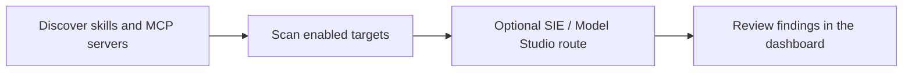

# Tripwire

> Discover and scan AI skills and MCP servers, then review the findings in one dashboard.

<!-- badges:start -->
<!-- Group 1: Tech stack -->


<!-- Group 2: CI / Quality -->
[](https://github.com/neomatrix369/tripwire/actions/workflows/ci.yml)
[](https://github.com/neomatrix369/tripwire/actions/workflows/nightly.yml)
[](https://github.com/neomatrix369/tripwire/actions/workflows/complexity-report.yml)
[](https://github.com/neomatrix369/tripwire/actions/workflows/code-review-graph.yml)
[](https://www.meterian.com/report/gh/neomatrix369/tripwire)
[](https://www.meterian.com/report/gh/neomatrix369/tripwire)
[](https://www.meterian.com/report/gh/neomatrix369/tripwire)
<!-- Coverage: uncomment after adding CODECOV_TOKEN to GitHub Secrets -->
<!-- [](https://codecov.io/gh/neomatrix369/tripwire) -->
[](https://github.com/neomatrix369/tripwire/releases)
[](https://github.com/neomatrix369/tripwire/blob/main/LICENSE)
[](https://github.com/neomatrix369/tripwire/commits/main)
[](https://github.com/neomatrix369/tripwire)
<!-- badges:end -->


## What Tripwire does

Tripwire helps technical teams assess AI skills and MCP servers before they rely
on them. It discovers targets, runs the enabled scanner adapters in an isolated
scan environment, stores the findings, and brings them together in one dashboard.
Optionally, after each scan batch it runs a tiered router: **Superlinked SIE**
triages findings, and **Alibaba Cloud Model Studio** escalates when scanners
disagree or coverage looks incomplete.

## Who Tripwire is for

Tripwire is currently an early-adopter tool with a hands-on setup and management
component. It is a good fit if you are comfortable using a terminal and shell,
managing local tooling and environment variables, editing `.env` and other
configuration files carefully, creating cloud/vendor accounts, and using command
output to resolve a setup issue.

| You are... | You want to... |
|---|---|
| An AI-tooling developer or team | Assess skills and MCP servers before using or sharing them |
| A platform, operations, or security practitioner | Run and maintain scans for a team |
| A contributor | Extend scanner support, the CLI, or the dashboard |

You do not need to be a security specialist, but you should be ready to interpret
findings and decide when to escalate them. The optional Mock preview is available
for evaluating the dashboard without accounts; real scans require the setup below.

If you plan to change Tripwire, start the [contributor setup](CONTRIBUTING.md#dev-hygiene)
after cloning: it installs the commit and push hooks before your first change.

## Run your first Live scan

Follow this order before running a scan or opening the Live dashboard. The
[Quickstart](QUICKSTART.md#first-live-scan) supplies the commands; the linked guides
explain each decision before you make it.

1. Check the required tools and [install the CLI](docs/user-guide/setup-commands.md#repository-and-cli-bootstrap).
2. Create the accounts you need: [Supabase](docs/user-guide/supabase-setup.md),
   [Modal](docs/user-guide/modal-setup.md), then add Snyk, Tessl, and Cisco credentials
   with the [environment-variable procurement guide](docs/user-guide/env-vars.md#vendor-procurement-quick-steps).
   For optional post-scan routing, also set up [Superlinked SIE](docs/user-guide/sie-setup.md)
   and [Alibaba Cloud Model Studio](docs/user-guide/model-studio-setup.md).
3. Create `.env` only after you have the values, then fill it with
   [env-vars.md](docs/user-guide/env-vars.md) as the single key reference.
4. Bootstrap Supabase and deploy the Modal scan app with the
   [Live setup commands](docs/user-guide/setup-commands.md#live-environment-bootstrap).
5. Run a fixture scan and open the Live dashboard from the
   [Quickstart](QUICKSTART.md#live-capabilities).

Supabase and Modal are required for Live results. If Snyk, Tessl, or Cisco credentials
are absent, Tripwire reports that scanner as skipped rather than calling the scan complete.
SIE and Model Studio are optional: without them, scans still complete and auto-route
logs a warning and skips.

## Preview the dashboard (optional)

Use Mock demo data only when you want a no-account look at the UI; it does not replace
the Live setup above or produce a scan result.

```bash
git clone https://github.com/neomatrix369/tripwire.git
cd tripwire
node scripts/serve-dashboard.mjs
```

Open [http://127.0.0.1:8765/Tripwire.dc.html](http://127.0.0.1:8765/Tripwire.dc.html).

After installing the CLI, you can also validate target discovery locally without
accounts or a scan:

```bash
tripwire scan --dry-discover ./fixtures/skills/safe-csv-cleaner
```

## What happens next

The workflow is deliberately small: discover the target, scan it with the enabled
adapters, optionally route findings through Superlinked SIE (and Model Studio on
escalation), then review the result. Mock lets you explore the final step safely;
Live uses Supabase, Modal, and the configured Snyk, Tessl, and Cisco scanners for
real scans.


### Screenshots

<table>
<tr>
  <td align="center" width="25%">
    <a href="docs/screenshots/01-cli/02-cli-real-scan-modal-sandbox.png">
      
    </a>
    <sub><b>CLI scan</b> — Modal sandbox (live)</sub>
  </td>
  <td align="center" width="25%">
    <a href="docs/screenshots/02-dashboard/02-dashboard-overview-grid.png">
      
    </a>
    <sub><b>Dashboard</b> — Mock overview</sub>
  </td>
  <td align="center" width="25%">
    <a href="docs/screenshots/03-skills/04-red-skill-detail-vuln-prompt-injection.png">
      
    </a>
    <sub><b>Skill finding</b> — Red (Mock)</sub>
  </td>
  <td align="center" width="25%">
    <a href="docs/screenshots/04-mcp-servers/10-red-mcp-detail-vuln-command-injection.png">
      
    </a>
    <sub><b>MCP finding</b> — Red (Mock)</sub>
  </td>
</tr>
</table>

> Full gallery with all severity levels and surfaces → [docs/screenshots/](docs/screenshots/README.md)

## Find the right guide

| Your task | Start here |
|---|---|
| Run your first Live scan | [Follow the Quickstart](QUICKSTART.md#first-live-scan) |
| Preview the dashboard or validate locally | [Optional local validation](QUICKSTART.md#validate-locally-optional) |
| Enable optional SIE / Model Studio routing | [SIE setup](docs/user-guide/sie-setup.md) · [Model Studio setup](docs/user-guide/model-studio-setup.md) |
| Understand results and system shape | [Capability status](docs/STATUS.md) · [Architecture](docs/ARCHITECTURE.md) · [Decisions](docs/adr/README.md) |
| Contribute or maintain the project | [Contributing](CONTRIBUTING.md) · [command catalog](docs/user-guide/setup-commands.md) |

For the full documentation map, see [docs/README.md](docs/README.md). The
[prerequisites](docs/user-guide/prerequisites.md), [environment-variable guide](docs/user-guide/env-vars.md),
and [setup command catalog](docs/user-guide/setup-commands.md) hold the detailed setup
and maintenance instructions.
