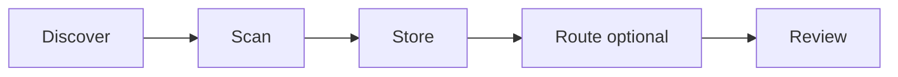

# Tripwire

> Discover and scan AI skills and MCP servers, then review the findings in one dashboard.

**Tripwire is a metal detector for AI tools.** It finds skills and chat plug-ins,
checks them with safety scanners, and shows the results in one screen.

## Where do you want to go?

| If you want to… | Go here |
|---|---|
| **Try a safe demo** (no cloud accounts) — Recommended | [QUICKSTART — Try the demo](QUICKSTART.md#try-the-demo-recommended) |
| **Run a real Live scan** — Advanced | [QUICKSTART — Live](QUICKSTART.md#live-advanced) |
| **Change the code** | [CONTRIBUTING](CONTRIBUTING.md) |
| **Understand the system** | [docs hub](docs/README.md) · [Architecture](docs/ARCHITECTURE.md) · [Status](docs/STATUS.md) |

Badges and stack

<!-- badges:start -->
<!-- Group 1: Tech stack -->

<!-- Group 2: CI / Quality -->

<!-- badges:end -->

Meterian **Security** / **Stability** / **Licensing** badges mirror the public
[Meterian project report](https://www.meterian.com/report/gh/neomatrix369/tripwire).
CI / Nightly / Complexity badges reflect GitHub Actions on `main`.

## Who this is for

You should be comfortable with a terminal, `.env` files, and creating cloud
accounts when you want **Live** scans. A no-account **Mock** preview is available
to look at the dashboard first.

| You are… | You want to… |
|---|---|
| An AI-tooling developer or team | Assess skills and MCP servers before using them |
| A platform / ops / security practitioner | Run and maintain scans for a team |
| A contributor | Extend scanners, CLI, or dashboard — start [Dev hygiene](CONTRIBUTING.md#dev-hygiene) after clone |

## How it works (short)

| Step | Plain words | Stack |
|---|---|---|
| Discover | Find skills / MCP servers | Node.js CLI |
| Scan | Check them in an isolated sandbox | Modal + Cisco / Snyk / Tessl |
| Store | Save results for the dashboard | Supabase |
| Route (optional) | Smart sorter; second checker only when needed | Superlinked SIE → Model Studio |
| Review | One dashboard (Live or Mock) | [reading-router-results](docs/user-guide/reading-router-results.md) |

Full setup, vendor keys, and commands: **[QUICKSTART](QUICKSTART.md)** · task map: **[docs/README](docs/README.md)**.

### Screenshots

[CLI scan](docs/screenshots/01-cli/02-cli-real-scan-modal-sandbox.png) ·
[Dashboard](docs/screenshots/02-dashboard/02-dashboard-overview-grid.png) ·
[Escalated filter](docs/screenshots/02-dashboard/14-filter-escalated.png) ·
Full gallery → [docs/screenshots/](docs/screenshots/README.md)

Visual identity (cream paper, tan CTA): [PR #96](https://github.com/neomatrix369/tripwire/pull/96).

## Report a vulnerability

See [SECURITY.md](SECURITY.md).
