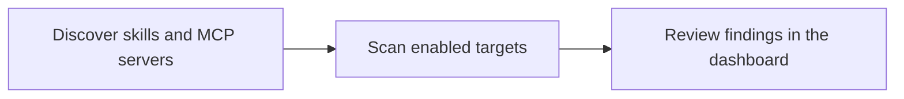

# Tripwire

> Discover and scan AI skills and MCP servers, then review the findings in one dashboard.

[](https://github.com/neomatrix369/tripwire/actions/workflows/ci.yml)
[](https://github.com/neomatrix369/tripwire/actions/workflows/nightly.yml)
[](https://cursor.com)
[](https://modal.com)
[](https://supabase.com)
[](https://developer.cisco.com)
[](https://snyk.io)
[](https://tessl.io)

## Run your first Live scan

Follow this order before running a scan or opening the Live dashboard. The
[Quickstart](QUICKSTART.md#first-live-scan) supplies the commands; the linked guides
explain each decision before you make it.

1. Check the required tools and [install the CLI](docs/user-guide/setup-commands.md#repository-and-cli-bootstrap).
2. Create the accounts you need: [Supabase](docs/user-guide/supabase-setup.md),
   [Modal](docs/user-guide/modal-setup.md), then add Snyk, Tessl, and Cisco credentials
   with the [environment-variable procurement guide](docs/user-guide/env-vars.md#vendor-procurement-quick-steps).
3. Create `.env` only after you have the values, then fill it with
   [env-vars.md](docs/user-guide/env-vars.md) as the single key reference.
4. Bootstrap Supabase and deploy the Modal scan app with the
   [Live setup commands](docs/user-guide/setup-commands.md#live-environment-bootstrap).
5. Run a fixture scan and open the Live dashboard from the
   [Quickstart](QUICKSTART.md#live-capabilities).

Supabase and Modal are required for Live results. If Snyk, Tessl, or Cisco credentials
are absent, Tripwire reports that scanner as skipped rather than calling the scan complete.

## Preview the dashboard (optional)

Use Mock demo data only when you want a no-account look at the UI; it does not replace
the Live setup above or produce a scan result.

```bash
git clone https://github.com/neomatrix369/tripwire.git
cd tripwire
node scripts/serve-dashboard.mjs
```

Open [http://127.0.0.1:8765/Tripwire.dc.html](http://127.0.0.1:8765/Tripwire.dc.html).

## What happens next

The workflow is deliberately small: discover the target, scan it with the enabled
adapters, then review the result. Mock lets you explore the final step safely; Live
uses Supabase, Modal, and the configured Snyk, Tessl, and Cisco scanners for real scans.



## Find the right guide

| Your task | Start here |
|---|---|
| Run your first Live scan | [Follow the Quickstart](QUICKSTART.md#first-live-scan) |
| Preview the dashboard or validate locally | [Optional local validation](QUICKSTART.md#validate-locally) |
| Understand results and system shape | [Capability status](docs/STATUS.md) · [Architecture](docs/ARCHITECTURE.md) |
| Contribute or maintain the project | [Contributing](CONTRIBUTING.md) · [command catalog](docs/user-guide/setup-commands.md) |

For the full documentation map, see [docs/README.md](docs/README.md). The
[prerequisites](docs/user-guide/prerequisites.md), [environment-variable guide](docs/user-guide/env-vars.md),
and [setup command catalog](docs/user-guide/setup-commands.md) hold the detailed setup
and maintenance instructions.
