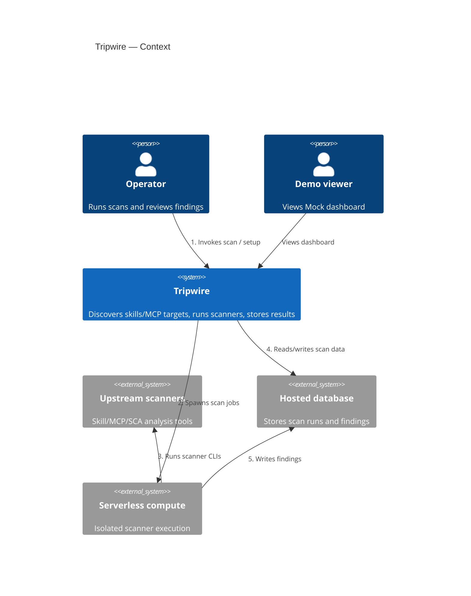
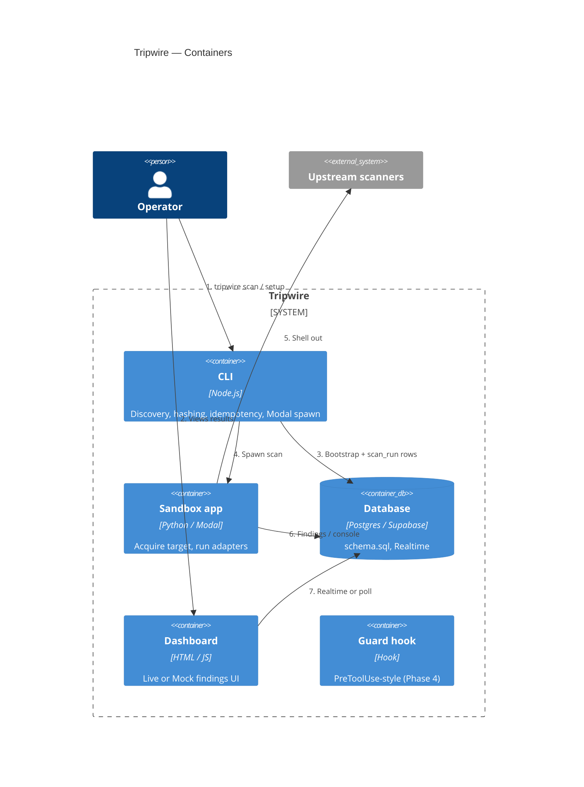
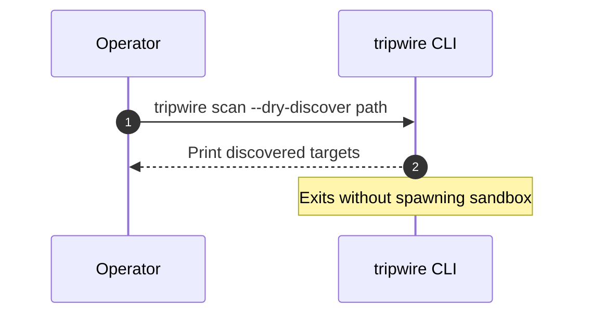
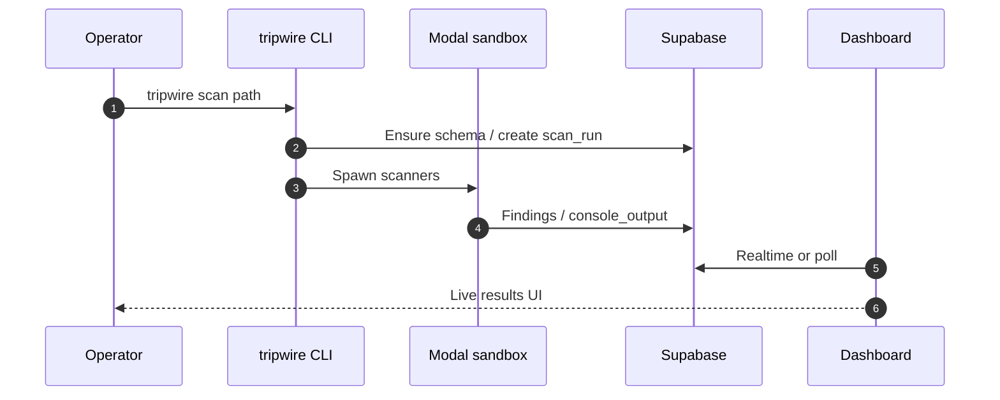

# Architecture

System shape for Tripwire. Diagrams are Mermaid (text, version-controlled).

Repo entry: [README.md](../README.md) · Status: [STATUS.md](./STATUS.md)

---

## 1. Context (C4 L1)

Who uses Tripwire, and what it talks to (no container tech detail).

---

## 2. Containers (C4 L2)

Deployable / runnable units inside the system boundary.

### Repo layout (where containers live)

- `cli/` — `tripwire` Node CLI
- `sandbox/` — Modal app + scanner adapters (`scanners.py`)
- `db/schema.sql` — Postgres/Supabase DDL + rollup; anon SELECT + Realtime
- `prototypes/dc-dashboard/` — Live/Mock dashboard
- `scripts/` — setup (Supabase/Modal), `serve-dashboard.mjs`, hygiene gates
- `guard/` — PreToolUse-style hook (Phase 4)
- `fixtures/` — smoke targets — [fixtures/README.md](../fixtures/README.md)
- `docs/research/adapters/scanner-output-adapters.md` — keep in sync with `sandbox/scanners.py`

---

## 3. Key Flows

### Dry-discover (no Modal)

### Full scan (Supabase + Modal + dashboard)

---

## 4. Component Detail (C4 L3)

Omitted — container internals are readable from `cli/`, `sandbox/`, and
`prototypes/dc-dashboard/`. Add L3 only when a container becomes hard to navigate
from the code.

---

## 5. Decisions

- Planning decisions: [plan/DECISIONS.md](./plan/DECISIONS.md)
- Slice progress: [plan/PROGRESS.md](./plan/PROGRESS.md)
- Formal ADRs (`docs/adr/`) — none yet; add when a major technology or boundary
  choice needs a durable record
