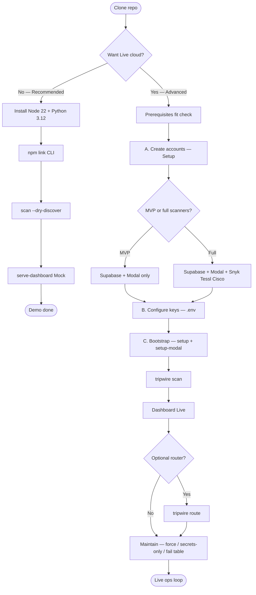
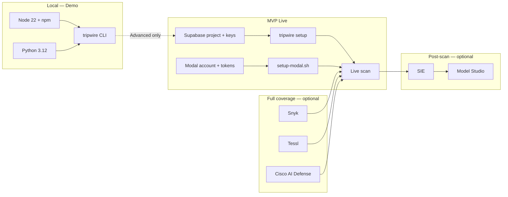
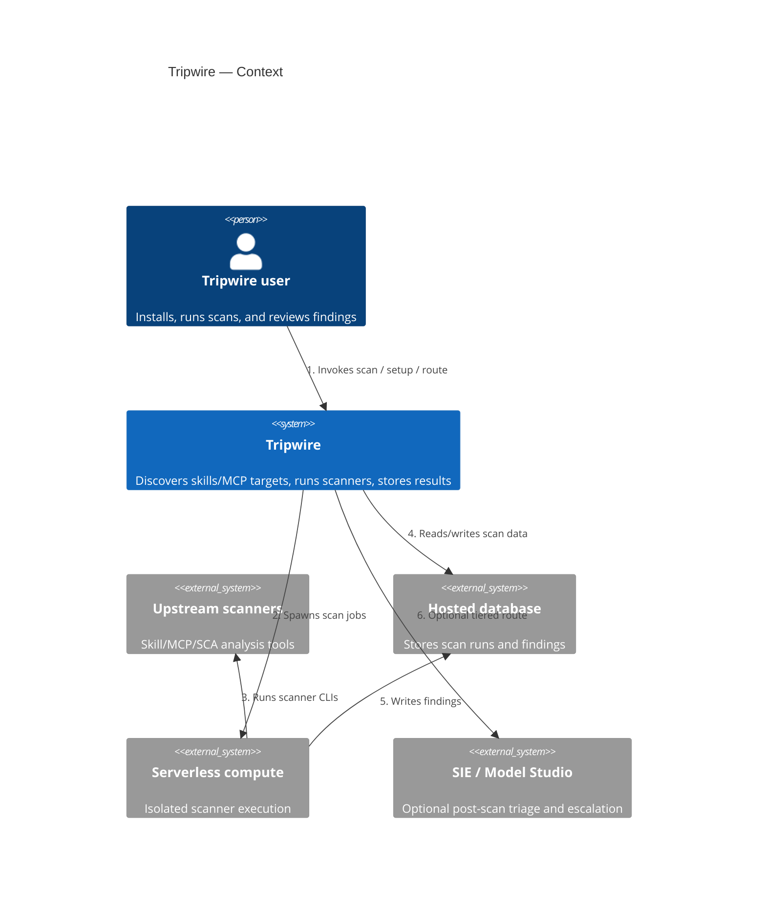
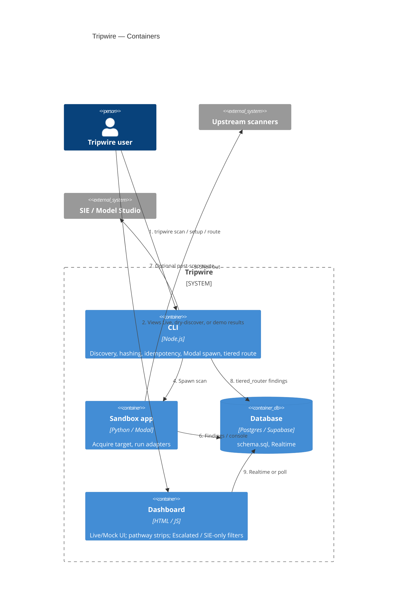
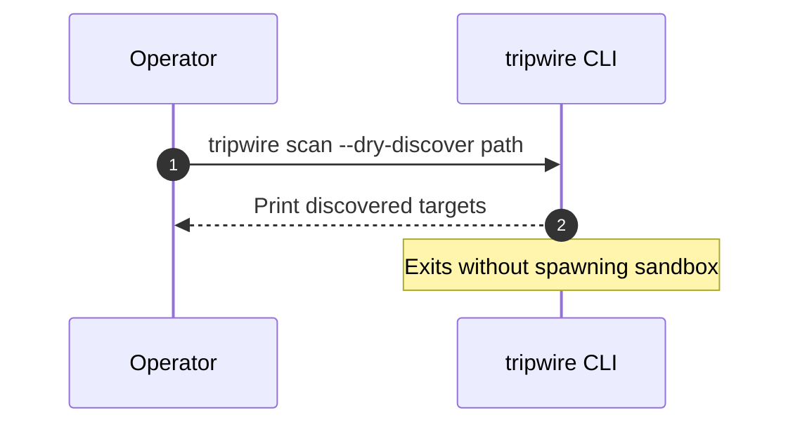

# Architecture

This page is a **map of the parts**. Skip it until you can run the
[demo Quickstart](../QUICKSTART.md#try-the-demo-recommended).

System shape for Tripwire. Diagrams are Mermaid (text, version-controlled).

Start here: [QUICKSTART](../QUICKSTART.md) · Hub: [docs/README](./README.md) · Status: [STATUS.md](./STATUS.md)

[](https://cursor.com)
[](https://modal.com)
[](https://supabase.com)
[](https://github.com/neomatrix369/tripwire)

[](https://developer.cisco.com)
[](https://snyk.io)
[](https://tessl.io)
[](https://superlinked.com)
[](https://www.alibabacloud.com/product/modelstudio)

---

## 0. External services (inventory)

Named dependencies Tripwire uses or can use. **Setup** = create account/project;
**Configure** = keys / wiring. Local tools (Git, Node, Python, npm) are not cloud
services — see [prerequisites](./user-guide/prerequisites.md).

| Service | Role | Needed for | Setup / Configure |
|---|---|---|---|
| **Supabase** | Postgres + Realtime system of record | MVP Live | [supabase-setup](./user-guide/supabase-setup.md) → [env-vars](./user-guide/env-vars.md) |
| **Modal** | Isolated scanner sandbox compute | MVP Live | [modal-setup](./user-guide/modal-setup.md) → [env-vars](./user-guide/env-vars.md) |
| **Snyk** | Skill/MCP depth scanner | Full scanner coverage | [procurement](./user-guide/env-vars.md#vendor-procurement-quick-steps) |
| **Tessl** | Skill lint (auth-free) + review run quality (`TESSL_TOKEN` + `TESSL_WORKSPACE`) + Scenario Generation (`TESSL_TOKEN` + `.tessl-plugin/plugin.json`; IMPLEMENTED unit, slice 49) | Full scanner coverage | [procurement](./user-guide/env-vars.md#vendor-procurement-quick-steps) |
| **Cisco AI Defense** | Skill Scanner / MCP Scanner / AI Defense APIs | Full scanner coverage | [procurement](./user-guide/env-vars.md#vendor-procurement-quick-steps) |
| **Superlinked SIE** | Cheap post-scan triage | Optional tiered router | [tiered-router-setup](./user-guide/tiered-router-setup.md) |
| **Alibaba Cloud Model Studio** | Escalation arbitration / triage | Optional tiered router | [tiered-router-setup](./user-guide/tiered-router-setup.md) |
| **DepShield** (`depshield-mcp`) | Local dependency-audit adapter over MCP stdio | Optional / local | No cloud account — npm package; see [STATUS](./STATUS.md) |
| **GitHub Actions** | CI / Nightly / complexity workflows | Contributors | Repo secrets as needed — not operator Live |
| **Cursor / Claude Code** | Dev tooling; Wave H agent hooks (plan) | Contributors / future hooks | [agent-hooks](../agent-hooks/README.md) · Wave H in [TRAIL](./plan/TRAIL.md) |

Demo / Mock path needs **no** rows above. Capability honesty: [STATUS.md](./STATUS.md).

### Operator journey (start → finish)



### Dependency order (what before what)



---

## 1. Context (C4 L1)

Who uses Tripwire, and what it talks to (no container tech detail).



---

## 2. Containers (C4 L2)

Deployable / runnable units inside the system boundary.



### Repo layout (where containers live)

- `cli/` — `tripwire` Node CLI (`scan`, `setup`, `route`)
- `sandbox/` — Modal app + scanner adapters (`scanners.py`); unit tests in `sandbox/tests/`
- `db/schema.sql` — Postgres/Supabase DDL + rollup + `dashboard_latest_runs` view
  (Live dashboard: one latest `scan_run` per item); anon SELECT + Realtime
- `prototypes/dc-dashboard/` — Live/Mock dashboard (Horizon A ship UI; prototype path). Shows router pathway strips (`Scan → ■` / `Scan → SIE → ■` / `Scan → SIE → Model Studio`) and Escalated / SIE-only filters — [reading-router-results.md](./user-guide/reading-router-results.md)
- `prototypes/sie-studio/` / `prototypes/model-studio/` — sample CLIs for router backends
- `scripts/` — setup (Supabase/Modal), `serve-dashboard.mjs`, hygiene gates, router fixtures
- `fixtures/` — smoke targets — [fixtures/README.md](../fixtures/README.md)
- `docs/research/adapters/scanner-output-adapters.md` — keep in sync with `sandbox/scanners.py`

### Scanner timeout budget

Scanners in `run_all_scanners` run **sequentially**. Each adapter passes an
individual `timeout=` to `_run`; `SCAN_TIMEOUT` (240s) is the per-call ceiling.
Modal hard-kills the sandbox at `TIMEOUT_SECONDS` (300s in `scan_app.py`).

| Constant | Value | Role |
| -------- | ----- | ---- |
| `SCAN_TIMEOUT` | 240s | Default per-scanner subprocess cap |
| `DEPSHIELD_TIMEOUT` | 120s | DepShield MCP stdio client |
| `OSSPREY_TIMEOUT` | 100s | Ossprey malware scan (tail group) |

CI enforces `DEPSHIELD_TIMEOUT + OSSPREY_TIMEOUT <= SCAN_TIMEOUT` via
[`scripts/check-scanner-timeout-budget.sh`](../scripts/check-scanner-timeout-budget.sh).
Earlier groups (Skill, Tessl, MCP, Snyk) must finish within the remaining wall
clock before Modal's 300s kill — operators reconcile stranded `running` rows with
[`scripts/reconcile-stuck-scan-runs.mjs`](../scripts/reconcile-stuck-scan-runs.mjs).

### Future (not current Horizon A containers)

- `guard/` — PreToolUse-style Agent Guard hook. **Horizon A:** Won't / not a
  shipped production entry ([ADR-0015](./adr/0015-horizon-a-excludes-guard-and-drift.md)).
  **Wave H (Frontline, DECIDED plan-only):** slices 23–39 intend Claude Code
  hooks + `tripwire setup-agent-hooks` + `/tw-*` skills —
  [plan/TRAIL.md](./plan/TRAIL.md) Wave H. Code stub may exist; it is **not** a
  shipped production entry point yet. See [STATUS.md](./STATUS.md).

---

## 3. Key Flows

### Dry-discover (no Modal)



### Full scan (Supabase + Modal + dashboard)

```mermaid
sequenceDiagram
  autonumber
  participant Op as Operator
  participant CLI as tripwire CLI
  participant SB as Modal sandbox
  participant DB as Supabase
  participant Route as SIE / Model Studio
  participant Dash as Dashboard

  Op->>CLI: tripwire scan path
  CLI->>DB: Ensure schema / create scan_run
  CLI->>SB: Spawn scanners
  SB->>DB: Findings / console_output
  CLI->>Route: Auto-route batch (optional; warn+skip if keys missing)
  Route-->>CLI: Triage / escalation
  CLI->>DB: tiered_router findings
  Dash->>DB: Realtime or poll
  Dash-->>Op: Live results UI
```

Manual re-route: `tripwire route --batch-id …` ([setup-commands.md](./user-guide/setup-commands.md#tiered-router-optional)).

### Tiered routing

Multi-scanner batches can disagree on severity, leave unusual scanner statuses
(timeout / unreachable), or produce low-confidence finding text. Operators need a
post-scan signal separate from raw scanner rows.

1. **SIE** (cheap / every item) decides whether to escalate using pre-computed
   `conflicting` + `unusual_status` plus its own `low_confidence` judgment.
2. **Model Studio** (stronger / escalate only) runs either **arbitration**
   (findings present) or **triage** (empty findings + coverage gap).
3. Persist one `tiered_router` finding per item (`routing_review` /
   `routing_decision` / `routing_triage`). Replace that item's prior router row
   only after a successful SIE decision — never batch-delete first.
4. Dashboard surfaces pathway strips and Escalated / SIE-only filters
   ([reading-router-results.md](./user-guide/reading-router-results.md)).

Missing SIE credentials → warn and skip (scan unaffected). See
[ADR-0016](./adr/0016-tiered-router-sie-model-studio.md).

### Quality attributes — severity rollup

`tripwire_rollup_item` aggregates **scanner** findings only. Rows with
`scanner_source = 'tiered_router'` are excluded so triage does not inflate
red/amber counts or `risk_score`. Card `heatmap_status` is worst-of actionable
scanner severities; finding-count chips are density, not colour
([ADR-0004](./adr/0004-supabase-system-of-record.md),
[ADR-0016](./adr/0016-tiered-router-sie-model-studio.md)).

`risk_score` (sort/trend only) =

`(3 × red_findings + 1 × amber_findings) / Σ checks_run` on completed scanners
for the latest run. Range ≥ 0 and unbounded; `null` when unscored. Dashboard
card colour must not be inferred from this number alone.

`quality_score` is the Tessl skill-review axis (0–100, higher better), written
by `run_tessl` / `_tessl_quality_score` and mapped into Live as `item.quality`
on the `"Tessl: Review (Quality)"` scanner row only. `"Tessl: Lint"` is a
separate `scan_run_scanners` row (slice 46 ✅ persist scan_run `a36cad9f`):
`tessl skill lint`, auth-free, no `tessl_run_id`. Review Quality (slice 47 ✅
[#109](https://github.com/neomatrix369/tripwire/pull/109))
uses `tessl review run quality --json --workspace` and stamps `tessl_run_id`
from `tessl review view --last --json`, then seeds in-process
`_TesslIdContext["review_quality"]` for slices 49–51 (GWT-47.5). It is orthogonal to findings and to `risk_score`. **IMPLEMENTED (UI):** slice 48 synthesises "Not Available Yet" sentinel rows for Scenario Generation, Eval, and Security Review when those sources are absent from the scan_run (never stored as placeholders). **IMPLEMENTED (unit, slice 49):** Scenario Generation writes a real `scan_run_scanners` row (`scenario generate` → `download` into `<plugin>/evals/`, `resume_checkpoint`, mid-scan persist). **DECIDED (runner not implemented):** slices 50–51 write Eval + Security rows — see
[design/tessl-5-row-expansion.md](./design/tessl-5-row-expansion.md) and slices
49–51; scenario→eval pipeline is generate → download → `eval run` on disk
`evals/` (sandbox-populated; host `evals/` is not a vuln-scan input — packing
exclude **IMPLEMENTED** in slice 48: Tessl plugin pack/copy omits root `evals/`;
git clone / `hashLocalPath` unchanged). Dashboard skill cards surface
compact `Q N` / `Q —` / `Q ?` badges with a fixed `#score-tip-portal` (not delayed
native `title=`, not in-card absolute bubbles that clip under `overflow-y: auto`);
risk uses compact `R N.NN` badges (list header **Risk density**) with the same
portal tip pattern — slice 42 A9–A13 IMPLEMENTED ([PR #98](https://github.com/neomatrix369/tripwire/pull/98));
operator chrome uses plain labels
(`Tessl quality`, locus/avail glossary) rather than schema snake_case.

Public docs map services and Setup→Maintain order in
[§0 External services](#0-external-services-inventory) (slice 44 GWT-44.8, ON BRANCH).

---

## 4. Component Detail (C4 L3)

Omitted — container internals are readable from `cli/`, `sandbox/`, and
`prototypes/dc-dashboard/`. Add L3 only when a container becomes hard to navigate
from the code.

---

## 5. Decisions

- Formal ADRs: [adr/README.md](./adr/README.md)
- Planning decisions (slice waivers, priority): [plan/DECISIONS.md](./plan/DECISIONS.md)
- Slice progress: [plan/PROGRESS.md](./plan/PROGRESS.md)
