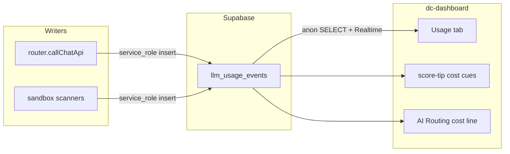

# Design: LLM Usage Tracking and UI Cost Surfacing

**Status**: DECIDED (plan captured + EFP-processed 2026-08-25) — not IMPLEMENTED. Build starts only after slice 53 execution on `slice/53-llm-usage-tracking`.
**Date**: 2026-08-25
**Scope**: Meter every LLM-touching path Tripwire can observe, persist events in Supabase, show a Usage log and cost cues in the Data Commons dashboard.
**Slice**: [slice-53-llm-usage-tracking](../plan/slices/13-M-llm-usage-tracking/slice-53-llm-usage-tracking.md) · **Wave group**: 13-M (LLM usage / cost observability)
**EFP**: health-check · quality-lens · AT Design · skill-proposer · `/nw-review` #1 (PO/AT/Craft) → revisions applied (redaction, phasing, AT oracles). Optional re-review before build.

---

## Decisions locked

| Decision | Choice | Rationale |
|----------|--------|-----------|
| Scope | Best-effort everything | Operators asked to see all LLM-related spend paths, not only the router |
| I/O logging | Full system+user prompt and raw model output for **router** calls | Explicit requirement to track input and output |
| Truncation | Cap each of `input_text` / `output_text` at 32 KiB; set `*_truncated` flags | Bound storage; never store API keys |
| Cost | Local price table → estimated USD; label `cost_basis` | Providers do not always bill Tripwire with a invoice line; estimates are honest when labelled |
| Opaque paths | Cisco LLM / Tessl SaaS: record event; tokens/`$` only if parseable | Do not invent vendor spend |
| Opaque heuristic | Off by default; `TRIPWIRE_LLM_ESTIMATE_OPAQUE=1` enables char/4 token estimate | Default stays honest `unknown` |
| Not resurrecting | Dedicated `llm_usage_events` table — **not** deferred `tripwire.audit` | Separate product concern |
| Redaction (GWT-53.8) | Pre-store strip of secret-shaped substrings; host-only endpoints | See § Redaction algorithm |
| Phasing | Phase 1 Must = schema + router + Usage tab/tips + CLI; Phase 2 Should = Cisco/Tessl writers | Cuts blast radius; craft review |
| History | Append-only event log — never overwrite prior transactions | Operators need past cost per call, not only “last” |
| Usage UI density | Transaction log **collapsed by default**; expand per row / per group | Manage long history without drowning the summary |

`cost_basis` enum: `provider_usage` | `estimate` | `unknown`.

### Redaction algorithm (DECIDED — closes craft Issue-3)

Before writing `input_text` / `output_text` / logging `provider_endpoint`:

1. **Endpoint:** store hostname + path only (strip query string; never store `Authorization` headers).
2. **Body redaction (lossy):** apply case-insensitive replacements, then truncate to 32 KiB:
   - Bearer tokens: `Bearer\s+\S+` → `Bearer [REDACTED]`
   - Common API key prefixes: `\b(sk-|sk-ant-|ospy_|tsi_|dashscope)[A-Za-z0-9_\-]{8,}\b` → `[REDACTED_KEY]`
   - `api[_-]?key["']?\s*[:=]\s*["']?[^"'&\s]+` → `api_key=[REDACTED]`
3. **Flags:** if any replacement ran, set `meta.redacted=true`; if length > cap, set `*_truncated=true`.
4. **Tests:** example-based (not PBT primary) — AT-53.8 cases for each pattern + oversize body; optional property check that redacted output never contains the original secret sample.

Operators must treat stored prompts as **security-sensitive** (finding text may remain); redaction is best-effort, not a guarantee.

---

## Current gaps (evidence)

| Path | Today | v1 capture |
|------|--------|------------|
| [`cli/src/router.js`](../../cli/src/router.js) `callChatApi` | Drops OpenAI-style `usage`; no latency | Exact tokens + wall latency + full I/O + $ estimate |
| Cisco Skill `--use-llm` / MCP `llm` + `behavioral` | Env gate only; spend inside vendor CLI | Mark invoked; parse console/JSON for usage if present; else `unknown` |
| Tessl review / scenario / eval / security | SaaS behind `TESSL_TOKEN` | Opaque event per feature row when that lane runs |
| Dashboard | Router strip / Escalated filters only | Usage tab + tips on cost-driving chrome |

Prototype CLIs (`prototypes/sie-studio/`, `prototypes/model-studio/`) already print `usage` for chat — product path does not. ADR-0016 remains the router behaviour contract; this design adds metering beside it.

---

## Architecture

Writers: CLI service role (router) and Modal sandbox service role (Cisco / Tessl). Reader: dashboard anon SELECT — same pattern as ADR-0008.

---

## 1. Data model

Add to [`db/schema.sql`](../../db/schema.sql) (idempotent; applied by `tripwire setup` / `ensureSchema`).

### Table `llm_usage_events`

| Column | Type | Notes |
|--------|------|-------|
| `id` | uuid PK | `gen_random_uuid()` |
| `created_at` | timestamptz | default `now()` |
| `batch_id` | uuid nullable | FK `scan_batches` when known |
| `scan_run_id` | uuid nullable | FK `scan_runs` when known |
| `item_id` | uuid nullable | FK `items` when known |
| `source` | text | see sources below |
| `purpose` | text | e.g. `triage`, `arbitration`, `scan_judge` |
| `model` | text nullable | |
| `provider_endpoint` | text nullable | **host only** — no secrets |
| `latency_ms` | integer nullable | |
| `prompt_tokens` | integer nullable | |
| `completion_tokens` | integer nullable | |
| `total_tokens` | integer nullable | |
| `estimated_cost_usd` | numeric nullable | |
| `cost_basis` | text | `provider_usage` \| `estimate` \| `unknown` |
| `input_text` | text nullable | router: full prompts (capped) |
| `output_text` | text nullable | router: raw content (capped) |
| `input_truncated` | boolean | default false |
| `output_truncated` | boolean | default false |
| `error` | text nullable | |
| `meta` | jsonb | signals, escalate, scanner label, parse notes |

**Sources:** `sie` | `model_studio` | `cisco_skill_llm` | `cisco_mcp_llm` | `cisco_mcp_behavioral` | `tessl_review` | `tessl_scenario` | `tessl_eval` | `tessl_security`

**RLS:** enable RLS; policy `anon_read_llm_usage_events` SELECT for `anon`; writes via service_role only. Grant SELECT to `anon` / `authenticated`. Add to Realtime publication with scan tables.

---

## 2. Instrumentation — router (accurate) — Phase 1

Refactor [`cli/src/router.js`](../../cli/src/router.js):

1. `callChatApi` returns `{ parsed, usage, latencyMs, rawContent, requestMessages }` (not parsed-only).
2. Time each attempt; keep one retry.
3. Insert one `llm_usage_events` row per attempt outcome via injectable Supabase client (composition root — same injectable-deps pattern as `callSieFn`). Tests use an in-memory store and **round-trip SELECT** the row (not a write-only spy).
4. **Drawer cost line:** query `llm_usage_events` by `item_id` + router sources. Mock fixtures may embed a small `usage` mirror for offline demo; **metering SSOT is the table**, not the finding message (ADR-0016 rollup exclusion unchanged).

Shared helpers — new `cli/src/llmUsage.js`:

- `estimateCostUsd({ model, promptTokens, completionTokens, priceTable })`
- `redactSecrets(text)` + `truncateForStore(text, maxBytes)` (Redaction algorithm above)
- Default price table keyed by model id (SIE 4B-class ~$1.78/1M; Model Studio for `qwen3.8-max`; document in env-vars).

Tests: `cli/test/router.test.js` + `llmUsage` unit — round-trip insert, truncation, redaction, failed-call rows.

---

## 3. Instrumentation — sandbox best-effort — Phase 2 (Should)

Ship after Phase 1 Usage tab works. In [`sandbox/scanners.py`](../../sandbox/scanners.py):

- After Skill `--use-llm` or MCP `llm` / behavioral: `record_llm_usage_event(...)` via `scan_app.py` service-role path.
- **Parser fixtures:** unit-test against checked-in synthetic OpenAI-shaped usage JSON under `sandbox/tests/testdata/llm_usage/` (not live vendor). If later a real Cisco console sample is captured, add it as a second fixture.
- **Tessl paid lanes:** opaque events (`cost_basis=unknown`) on terminal review/scenario/eval/security rows.
- Heuristic estimate only if `TRIPWIRE_LLM_ESTIMATE_OPAQUE=1` (document when to enable: operator wants rough $ with no vendor usage fields).

---

## 4. Dashboard UI — historic log (collapsible)

Surfaces: [`prototypes/dc-dashboard/Tripwire.dc.html`](../../prototypes/dc-dashboard/Tripwire.dc.html), [`tripwire-live.js`](../../prototypes/dc-dashboard/tripwire-live.js), mock fixtures in `tripwire-data.js`.

**Invariant:** every metered call is an immutable row in `llm_usage_events`. The UI shows **history** (past transactions), not a single “current cost” overwrite.

### A. Top-nav tab `Usage`

**Summary strip (always visible):** totals over a selectable window — default **All fetched** (up to fetch limit); optional chips: Today / 7d / 30d / This batch — sum of known `$`, token totals, call count, unknown-cost count, p50/p95 latency for router sources.

**Transaction log (collapsible — default collapsed):**

- Header row: `▸ Transaction log (N)` — click/toggle expands the full chronological list (newest first).
- Collapsed: show only summary + optional one-line “Last call: … $x · Nm ago” so operators see recency without opening the log.
- Expanded: table — time, item, source, model, tokens in/out, latency, $ / basis, error.
- **Per-row collapse:** each transaction is a compact line; expand (chevron / click) reveals input/output mono panes for that call only (not all rows open at once).
- Optional **group by day** or **group by item** (collapsed group headers with group subtotal `$`); default = flat chronological list.
- Live: fetch recent N (e.g. 200, newest first) + Realtime inserts prepend; Mock: multi-day fixtures so history is demonstrable offline.
- Filter controls (when expanded): source, item search, cost_basis — do not reset collapse state unnecessarily.

### B. Cost cues (reuse `.score-tip` + `#score-tip-portal`)

| Chrome | Content |
|--------|---------|
| Overview **Escalated** / **SIE-only** | SIE always vs Model Studio on escalate; cost class |
| Drawer **AI Routing** | **Latest** hop cost + latency; **▸ Prior routes** collapsed section listing previous router usage events for this `item_id` (historic) |
| Cisco LLM / Tessl paid scanner rows | `LLM` tip: unknown or N tokens for **this** run; link/hint to Usage tab history |
| Guard tab | No LLM $ tips (local policy) |

### C. List “Scan history”

When a listed scan batch has usage events, show batch subtotal `$` (known) + unknown count; clicking opens Usage tab filtered to that `batch_id` (log expands with filter applied).

### D. Retention (v1)

No purge job in v1 — append-only history grows with scans. Document practical fetch limit (200) and that older rows remain in Postgres for CLI/`--limit` / later pagination. Retention TTL = follow-up Could if needed.

---

## 5. CLI / operator visibility

- `tripwire usage --limit N` (or extend `tripwire status`) lists recent events from Supabase.
- One structured console line per router call: tokens + ms + $ — no full prompt on stdout.

---

## 6. Docs / ADR (at implementation time)

Ship with the behaviour PR (not this plan-only PR unless desired):

- New ADR: `llm_usage_events`, estimate vs unknown, I/O caps.
- Update `docs/ARCHITECTURE.md`, `reading-router-results.md`, `env-vars.md`, `STATUS.md` evidence labels.

---

## Implementation order (slice 53)

1. Schema + RLS + grants + Realtime  
2. `llmUsage` helpers + router instrumentation + tests  
3. Sandbox Cisco + Tessl writers + parser tests  
4. Dashboard Usage tab + live/mock + tip chrome  
5. CLI listing + ADR + operator docs  

**Gate:** unit tests green; Mock Usage tab shows fixtures; Live smoke optional (VERIFIED only with dated probe).

---

## Out of scope

- Billing / provider account sync  
- UI rate-limits that stop LLM calls  
- Wave H FE/BE rearchitecture (slice 39)  
- Guaranteeing Cisco/Tessl dollar accuracy when vendors omit usage  

---

## Evidence-state summary

| Claim | State |
|-------|--------|
| Design + slice stub captured | DECIDED |
| `llm_usage_events` in production schema | not IMPLEMENTED |
| Router / sandbox writers | not IMPLEMENTED |
| Usage tab / cost tips | not IMPLEMENTED |
