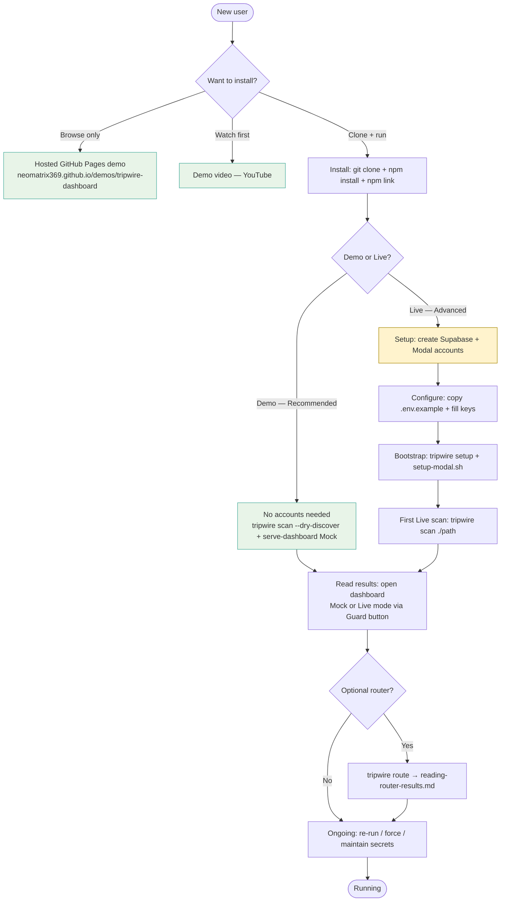
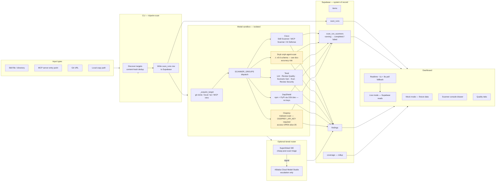

# Tripwire — Docs & Internals Gap-Bridging Audit

> **Status**: Planning complete. Execution queued as Wave N (slice-44 GWT-44.9 pile-on + slices 55–57; 56-f added post-review 2026-08-31).
> **Method**: Diagram-driven checkpoint walk per CO-STAR brief (2026-08-28).
> **Principle**: Verify first, reorganise before writing, write new only when gap is confirmed real.
> **North star**: A complete newcomer can navigate entry-level docs without help.
> **Scope**: CLI + dashboard + backend/data layer (Supabase schema + data flow). `internal-docs/` excluded.
> **Disclaimer on all seeded gaps**: treated as hypotheses. Review was conducted against current `main` + pre-merge slice-44 branch (2026-08-21 state; assumes slice-44 lands without changes). Results are hypotheses; verification deferred until after slice-44 merges to `main`.

---

## Diagram A — User Journey



**Entry points covered by docs:** `README.md → QUICKSTART.md → docs/README.md → user-guide/*`

---

## Diagram B — Input → Process → Output (incl. Supabase & Providers)



**Schema tables:** `items`, `scan_runs`, `scan_run_scanners`, `findings`, `coverage` — defined in `db/schema.sql`, applied via `tripwire setup`.

---

## Checkpoint Walk — Diagram A (User Journey)

| CP | Step | Entry doc | Newcomer-simple? | Dependencies named+linked? | Verified statically? | Finding | Tag |
|---|---|---|---|---|---|---|---|
| A.1 | Install | `README.md` → QUICKSTART | ✅ One-liner + router table | ✅ `.nvmrc` / `.python-version` mentioned in prereqs | ✅ | Clean; badge wall below fold is fine | — |
| A.2 | Demo path | `QUICKSTART.md §Try the demo` | ✅ 3-step, copy-paste | ✅ prerequisites linked | ✅ | Clean post slice-44 | — |
| A.3 | Live — Setup accounts | `QUICKSTART.md §Live` → `supabase-setup.md`, `modal-setup.md` | ⚠ "Advanced" label good; MVP vs full not explicit pre-slice-44 | ✅ | **Needs slice-44 merge to be fully satisfied**; static review OK now | Recheck after slice-44 lands | P1/S |
| A.4 | Configure keys | `env-vars.md` | ✅ Table-driven; service-role warning present | ✅ | ✅ | Clean | — |
| A.5 | First scan | `QUICKSTART.md` / `setup-commands.md` | ⚠ Input types (what paths/URLs accepted by `tripwire scan`) not explained for newcomers | ⚠ `_acquire_target` modes undocumented in user guide | Needs check | **Confirmed gap**: no user-facing "what can I scan?" table | P1/M |
| A.6 | Reading results | `reading-router-results.md`, dashboard Guard button | ⚠ Guard button intro is runtime discovery only — not in any doc page | ✅ | Static OK | **Suspected gap**: Guard/Mock mode transition needs one sentence in QUICKSTART or user-guide | P1/S |
| A.7 | Ongoing use | `setup-commands.md §Re-run` | ✅ Hub Maintain row (slice-44 pile-on) | ✅ | ✅ | Verify hub row lands in slice-44 merge | P1/S |
| A.8 | Optional router | `tiered-router-setup.md` + `reading-router-results.md` | ✅ Optional labelling present | ✅ SIE + Model Studio both linked | ✅ | Clean | — |

---

## Checkpoint Walk — Diagram B (Data / Provider Flow)

| CP | Node | Entry doc | Newcomer-simple? | Finding | Tag |
|---|---|---|---|---|---|
| B.1 | Input types | `QUICKSTART.md`, `ARCHITECTURE.md` | ⚠ User sees `./fixtures/skills/safe-csv-cleaner` path as example; accepted types not explicitly listed | **Confirmed gap**: add input-type taxonomy (skill dir, MCP entrypoint, git URL, local copy) to prerequisites or ARCHITECTURE | P1/M |
| B.2 | CLI hashing/dedup | `ARCHITECTURE.md §ADR-0010` | Fine for deep-layer readers; not needed at entry layer | No change needed at user layer | — |
| B.3 | Modal sandbox | `ARCHITECTURE.md`, `ADR-0003`, `modal-setup.md` | ✅ "Isolated sandbox" described at entry | ✅ | Clean | — |
| B.4 | Scanner dispatch | `STATUS.md` (capability honesty) | ⚠ Which scanner handles which input type not in one place | **Confirmed gap**: STATUS.md has per-scanner detail but no scanner×input-type matrix | P1/M |
| B.5 | Snyk adapter | `STATUS.md`, `scanner-output-adapters.md` | ✅ Adapter documented | ⚠ **doc-accuracy risk**: `run_snyk` parses old v0.5 schema against snyk-agent-scan v0.6+'s list-valued `scan_path_responses` — flagged, not a task for this audit | P0/doc-accuracy |
| B.6 | Tessl (5 rows) | `ARCHITECTURE.md §0 external services`, `STATUS.md`, slice-49/50 | ✅ All 5 rows described | ⚠ Scenario Gen / Eval rows: IMPLEMENTED (unit), not VERIFIED live — STATUS correctly labels them | Clean if STATUS is read | — |
| B.7 | Ossprey | `STATUS.md`, `fixtures/OPTIONAL_SCANNER_KEYS.md` | ✅ Disclaimed as access OPEN, no VERIFIED claim | ✅ | Clean | — |
| B.8 | Supabase writes | `ADR-0004`, `db/schema.sql`, `supabase-setup.md` | ⚠ Schema tables list (items, scan_runs, scan_run_scanners, findings, coverage) exists in STATUS but not in any user-guide page for new operators | **Suspected gap**: brief schema table in `supabase-setup.md` §4 or ARCHITECTURE would help operators; verify if STATUS reference is sufficient | P2/S |
| B.9 | Dashboard read-back | `QUICKSTART.md §Try the demo`, `serve-dashboard.mjs` | ✅ Realtime + poll described in STATUS | ⚠ `node scripts/serve-dashboard.mjs` command and its proxy role not explained — users may not understand why it's needed | **Confirmed gap**: one-liner explanation of proxy role in QUICKSTART or dashboard README | P1/S |
| B.10 | gate-evidence (quality tab) | `STATUS.md` | ✅ Marked as ON_BRANCH / gate_status — slice-44 | ⚠ Gate-evidence UI feature still PLANNED per TRAIL; not surfaced clearly as "not yet available" to end users in docs | **Suspected gap**: needs PLANNED callout in STATUS or dashboard page | P1/S |

---

## Cross-Navigability Check

| Check | Result | Finding | Tag |
|---|---|---|---|
| `setup-commands.md` ↔ `prerequisites.md` links | ✅ Bidirectional | Clean | — |
| `ARCHITECTURE.md` ↔ `ADR/` ↔ `STATUS.md` | ✅ All cross-linked | Clean | — |
| `user-guide/*` → `CONTRIBUTING.md` | ✅ CONTRIBUTING references prerequisites | Clean | — |
| `docs/README.md` hub ↔ all user-guide pages | ✅ Hub links all pages | Post slice-44 verify | — |
| `agent-hooks/README.md` ↔ `frontline-output-contract.md` | ✅ Hub mentions both | Clean | — |
| Slice-26 API output contract in SKILL.md → `docs/` | ⚠ Contract lives in `docs/plan/slices/08-H-frontline-agent-hooks/slice-26-api-output-contract.md`, not a user-facing doc | **Suspected gap**: user-facing behaviour is in `frontline-output-contract.md` — verify that doc is complete and cross-linked from agent-hooks README | P1/S |
| `docs/contributor-guide/module-theme-map.md` | ⚠ Directory does not exist on `main`; CO-STAR cites Slice 44 as precedent | **Suspected**: may be on slice/44 branch — verify after merge; if absent, add as P2 task | P2/S |
| `SECURITY.md` ↔ `docs/README.md` | ✅ Hub table has "Report a vulnerability" row | Clean | — |
| `CHANGELOG.md` ↔ user-facing docs | Not cross-linked; not required for users | Out of scope | — |

---

## Index Assessment

No new index warranted. `docs/README.md` already functions as a task-oriented hub (choose-a-task table). Adding a separate index would duplicate it. The hub's table is the index.

---

## Documentation-Accuracy Risks

> These are flagged for awareness only. No task is created to fix them in this audit wave.

| Risk | Detail | Recommendation |
|---|---|---|
| **Snyk v0.5/v0.6 schema mismatch** | `run_snyk()` in `sandbox/scanners.py` parses the old v0.5 `scan_path_responses` as a single value against snyk-agent-scan v0.6+'s list-valued shape — silently wrong results possible | Add a note in `STATUS.md §IMPLEMENTED` under Snyk adapter that "parser targets v0.5 shape; v0.6+ `scan_path_responses` is list-valued — pending adapter update". **Not a task here**; flag for a dedicated fix slice. |
| **Ossprey access OPEN** | Slice 35 🔴; adapter IMPLEMENTED but no live-Modal run recorded | `STATUS.md` correctly labels IMPLEMENTED/RESEARCH, not VERIFIED. Monitor for false-confidence copy in user-facing pages. |
| **gate-evidence quality UI** | PLANNED in TRAIL; slice-44 gate_status ON_BRANCH | If dashboard ships quality tab UI before gate-evidence is live, prominently label "Coming soon" in-product. Checkpoint B.10 |

---

## Needs Live Dry-Run Verification (Follow-Up)

These were statically reviewed only. Mark for a live dry-run in a later session:

1. `tripwire scan --dry-discover ./fixtures/skills/safe-csv-cleaner` end-to-end (confirms QUICKSTART step 3).
2. `node scripts/serve-dashboard.mjs` proxy behaviour with Mock mode (confirms Guard button and Mock/Live toggle UX).
3. `tripwire setup` schema-bootstrap path when Supabase project exists but columns are missing (`probes completed_at`).
4. Tessl Lint adapter with `TESSL_TOKEN` absent → confirm `needs_setup` rather than error crash.

---

## Docs-UX Best Practices Considered

| Practice | Verdict | Rationale |
|---|---|---|
| **Diataxis / Divio** (tutorial, how-to, reference, explanation) | **Adopted — partial** | Status breakdown: (1) GWT-44.8/44.9 add Diagrams A/B (Explanation content → Explanation doc) ✅ COMPLIANT; (2) DIVIO follow-on applied 2026-08-22 to `env-vars.md` + `prerequisites.md` (pre-existing collapse fixed in slice-44 branch) ✅ FIXED; (3) `setup-commands.md` collapse identified (lines mix tutorial step-by-step with reference tables) ⚠ **DEFERRED** — not in Wave N scope; logged as Wave O tech debt in DECISIONS.md; (4) Full type-by-type purity audit not in scope of this wave. QUICKSTART is a good tutorial/how-to hybrid. `ARCHITECTURE.md` = explanation. |
| **Progressive disclosure** (entry → details → internals) | **Adopted** | README → QUICKSTART → docs hub → user-guide/* → ARCHITECTURE → ADRs is a correct disclosure pyramid. North-star bar (newcomer-simple at top) is met at README + QUICKSTART level. |
| **Plain-language at entry** | **Adopted** (slice-44 in progress) | Slice 44 handles jargon compaction; apply same filter to any new content added in this wave. |
| **Docs-as-code single-source-of-truth** | **Adopted** | Mermaid diagrams in `ARCHITECTURE.md` are version-controlled; no duplicate diagram maintenance. `sync-docs` skill enforces parity. |
| **Consistent cross-linking** | **Adopted — mostly** | `docs/README.md` hub is the canonical navigation layer. Two gaps found (proxy role, input-type taxonomy). |
| **Separate Setup (create accounts) vs Configure (keys)** | **Adopted** (slice-44 pile-on) | GWT-44.5 establishes this vocabulary. New content in this wave must follow it. |
| **One index only** | **Adopted** | `docs/README.md` is the hub; no competing index created. |
| **Stale/incorrect content: flag, don't silently delete** | **Adopted** | All removal candidates below explicitly listed; executor must check relevance before deleting. |

Rejected practices:
- **Numbered versioned docs** (e.g. /v1/ path prefix) — overhead not justified for early-stage tool.
- **Separate troubleshooting file** — slice 44 explicitly absorbed troubleshooting into existing SSOTs.

---

## Disclaimers

> **All wording below is placeholder draft only. Pending Mani/legal review before any text goes live. Do not treat as final copy.**

Categories seeded: no-warranty/as-is; not a substitute for professional security review; false positives/negatives; third-party scanner dependency; risk score as heuristic; feature-maturity transparency; data handling disclosure; no liability for decisions made on results.

| # | Location | Trigger (when user could act without understanding limits) | Draft placeholder wording | Status |
|---|---|---|---|---|
| D1 | `README.md` — top of "What Tripwire does" | Any user, first read | "Tripwire is an early-adopter tool. Results are heuristic triage aids and depend on the accuracy of third-party scanners (Snyk, Cisco, Tessl, etc.). They are not a substitute for professional security review and carry no warranty. False positives and negatives are expected." | ⏳ Pending review |
| D2 | `QUICKSTART.md` — above Live scan section | User about to run real scans | "Live scans submit your skill and MCP server paths to third-party scanner APIs. Review each vendor's data handling policy before scanning sensitive or proprietary code." | ⏳ Pending review |
| D3 | `docs/STATUS.md` — top or §IMPLEMENTED | Operator assessing capability completeness | "Capability states (IMPLEMENTED, VERIFIED, etc.) reflect evidence at the date shown. Vendor APIs change; Tripwire carries no implied endorsement or affiliation with Snyk, Cisco, Tessl, or other scanner vendors." | ⏳ Pending review |
| D4 | `docs/ARCHITECTURE.md` — §0 External services | Contributor / operator choosing scanners | "Tripwire adapters target documented scanner output shapes at the time of writing. Schema changes in upstream scanner CLIs (e.g. `snyk-agent-scan` output format) may cause silent mis-parsing until the adapter is updated." | ⏳ Pending review |
| D5 | Dashboard — near risk-score / Quality badge | User reading a score and deciding to act | "Risk scores are heuristic triage aids generated by third-party scanners. They are not compliance certifications. Verify findings with a qualified security professional before acting on them." | ⏳ Pending review |
| D6 | Dashboard — per-finding card (tooltip or footer) | User about to act on one finding | "This finding comes from [scanner]. False positives and false negatives are possible. Treat this as a starting point, not a verdict." | ⏳ Pending review |
| D7 | CLI output — after each scan completes | User reading terminal output | "⚠ Results are heuristic. Verify critical findings independently." (one-line banner) | ⏳ Pending review |
| D8 | `CONTRIBUTING.md` — §Dev setup | Contributor running live scans in dev | "Do not scan real production skills or sensitive MCP servers in development without reviewing each scanner's data handling policy." | ⏳ Pending review |

---

## Not-Now List

| Item | Reason |
|---|---|
| Fix Snyk v0.5/v0.6 parser bug | Out of scope per CO-STAR; flagged as doc-accuracy risk only |
| `setup-commands.md` DIVIO purity refactor | Pre-existing collapse (tutorial steps mixed with reference tables). Not introduced by Wave N. Deferred to Wave O — requires splitting into `setup-commands-reference.md` + `setup-commands-howto.md`. Logged in DECISIONS.md as tech debt (2026-08-31). |
| New scanners or architectural rework | Out of scope |
| Live dry-run verification of setup commands | Deferred to follow-up session; each step flagged above |
| Batch-apply multiple backlog items in one pass | Execution cadence: one item at a time |
| Treat drafted disclaimers as final | Pending Mani/legal review |
| Create a separate troubleshooting file | Already decided against in slice 44 |
| Versioned docs paths | Overhead not justified |
| Remove `internal-docs/` content | Already CI-excluded; out of scope |

---

## Docs-UX Best Practices — Adoption for sync-docs Skill

The following should be folded into the `sync-docs` skill definition as a "Tripwire docs checkpoint-walk supplement" or a companion rule:

1. **Build Diagram A (user journey) and Diagram B (data/provider flow)** before any pass. Both in Mermaid (version-controlled in `ARCHITECTURE.md`).
2. **Walk each node**: verify newcomer-simple entry, named+linked dependencies, static accuracy.
3. **Cross-nav check**: hub ↔ user-guide ↔ architecture ↔ backend ↔ troubleshooting (five-way).
4. **Disclaimer placement checklist** (table above, D1–D8) — re-run on any new feature that produces risk scores or sends data to third-party APIs.
5. **Incremental execution cadence**: one backlog item per pass; re-check the specific checkpoint after each change; log outcome; proceed.
6. **Stale content rule**: flag for removal with a line in `DECISIONS.md`; do not silently delete.
7. **Index gate**: no new index if `docs/README.md` hub already covers navigation.

---

## Prioritised Backlog — Ordered Execution Queue

> One item at a time, highest priority first. Apply change → re-check diagram checkpoint → log outcome → proceed.

> **No-duplicate policy (2026-08-28):** Diagram A (operator/user journey) is already owned by slice-44 GWT-44.8 (ON BRANCH). Diagram B (runtime data/provider flow) is added as pile-on GWT-44.9 to slice 44 — no separate slice 54 created. Wave N starts at slice 55.

| Seq | Slice | Item | Priority | Effort | Checkpoint(s) | Acceptance signal |
|---|---|---|---|---|---|---|
| 1 | 55 | **Disclaimer placements** — add D1–D8 (draft, all marked pending-review) to docs + UI placeholder | P0 | M | D1-D8 | All 8 locations have placeholder text; pending-review annotation present |
| 2 | 44+GWT-44.9 | **Diagram B** — add Input→Process→Output runtime data flow to `ARCHITECTURE.md` as pile-on to existing slice 44 (which already owns Diagram A / operator journey via GWT-44.8) | P0 | M | B.1–B.10 | Diagram present in ARCHITECTURE; all scanner + Supabase nodes verified |
| 3 | 56-a | **Input-type taxonomy** — add "What can Tripwire scan?" table to `prerequisites.md` or ARCHITECTURE (CP A.5, B.1) | P1 | S | A.5, B.1 | Table lists: skill dir, MCP entrypoint, git URL, local copy; links to `_acquire_target` ADR |
| 4 | 56-b | **Dashboard proxy role** — add one-sentence explanation of `serve-dashboard.mjs` role to QUICKSTART Demo step 3 (CP B.9) | P1 | S | B.9 | Sentence present; no new file created |
| 5 | 56-c | **gate-evidence PLANNED callout** — add "Coming soon / PLANNED" label to STATUS.md under quality-tab feature (CP B.10) | P1 | S | B.10 | STATUS entry has PLANNED label with link to TRAIL slice |
| 6 | 56-d | **Guard/Mock mode transition** — add one sentence to QUICKSTART or dashboard user-guide page (CP A.6) | P1 | S | A.6 | Sentence present in QUICKSTART §Try the demo |
| 7 | 56-e | **Slice-26 API contract** — verify `frontline-output-contract.md` is complete and linked from `agent-hooks/README.md` (cross-nav) | P1 | S | cross-nav | Link present; content verified |
| 8 | 56-f | **Scanner×input-type matrix** — add lookup table (scanner × input type: skill dir / MCP / git URL / local) to `STATUS.md` with ADR-0003 link (CP B.4) | P1 | M | B.4 | Matrix present with 5 scanner rows × 4 input-type cols; ADR-0003 linked; `grep "Snyk\|DepShield" docs/STATUS.md` returns rows |
| 9 | 57 | **sync-docs skill update** — add checkpoint-walk method, disclaimer checklist, and incremental cadence to skill definition | P2 | M | — | Skill updated; method reproducible by any future contributor |
| 10 | 58 | **module-theme-map.md** — verify if it landed from slice-44 branch; if absent, create minimal contributor-guide/module-theme-map.md | P2 | S | — | File exists under `docs/contributor-guide/` or confirmed exists via slice-44 merge |

---

## Running Doc-Health Record

This audit extends `docs/STATUS.md` as the living record of capability and doc state. After each execution item:

1. Check relevant diagram checkpoint off in this file (change ⚠ → ✅ or add ✅ new row).
2. Log the outcome in `docs/plan/DECISIONS.md` with date, item seq, and result.
3. Update relevant STATUS.md section if a capability state changed.

No new tracking file is created; DECISIONS.md is the SSOT for outcomes.

---

## Proposed sync-docs Skill Addition

The following should be appended to the global `sync-docs` skill definition as a named checklist titled **"Checkpoint-walk method"**:

```
### Checkpoint-walk method (added 2026-08-28, derived from Tripwire docs audit)

1. Build a User Journey diagram and a Data/Provider Flow diagram in the project's primary architecture doc (Mermaid preferred).
2. Walk each node: (a) newcomer-simple at entry layer; (b) all referenced dependencies named and linked; (c) static accuracy flagged where live dry-run deferred.
3. Run cross-navigability check: identify five surfaces (setup, usage, architecture, backend/data, troubleshooting) and verify bidirectional links.
4. Evaluate index need: add one only if the existing hub does not cover navigation.
5. Apply disclaimer placement checklist: for any surface where a user could act on scan/risk results, draft placeholder text (D1–D8 table), mark pending-[legal/maintainer] review, and commit the placeholder — never ship without the marker.
6. Apply incremental execution cadence: one backlog item per pass, re-check the specific checkpoint, log outcome in DECISIONS.md, proceed.
7. Flag stale/incorrect content in DECISIONS.md for removal; do not silently delete.
8. Adopt Diataxis type separation and plain-language at entry; reject competing index if hub exists.
```
